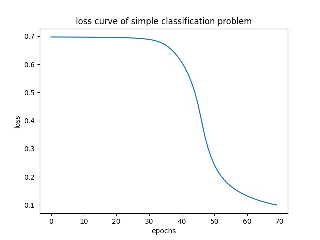
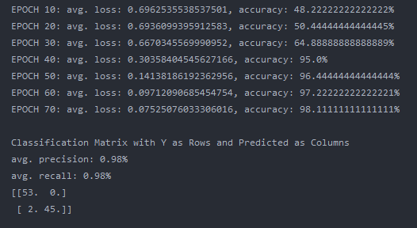
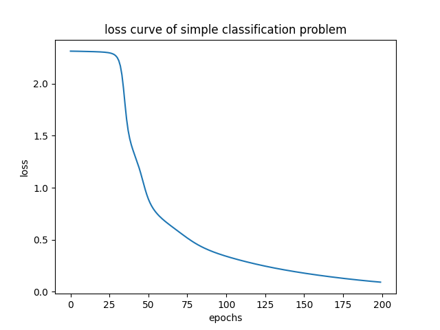
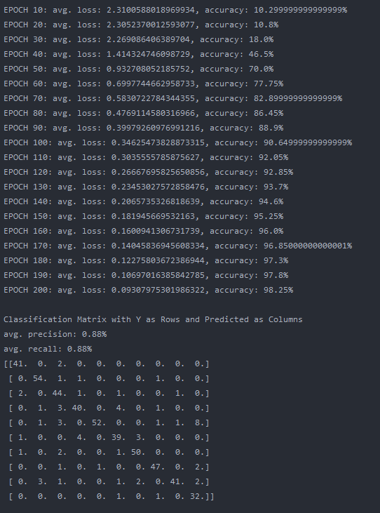

# NumpyNet
NumpyNet is a small but working neuronal network lib. It follows the structure of the state of the art frameworks
like Tensorflow, Keras or PyTouch. The main purpose was to learn how to create such a deep learning library. Therefore the entire repository is written in plain python and - as the name suggests - with the library Numpy. Numpy is used to make it easier to work with matrices and vectors. But not machine learning library was used for the entire project. NumpyNet is written in a generic way and therefore a user could easily create her or his own model. All images used in this README.md can be found in the folder *_meta*.

### How use NumpyNet

#### Dependencies
The project includes a Pipefile and venv with all dependencies required as well as a requirements.txt. The project was written in python 3.7 so make sure you use at least 3.7.*. Libraries used for this project:

- numpy
- matplotlib (for visualizations)
- sklearn (only used for experiment data generation in *numpynet_experiment/simple_classification*)

#### Usage
In order to use NumpyNet one would initialize a model in the following way:
```
# import modules
from NumpyNet.model.model import Sequence
from NumpyNet.layers.connected import Dense
from NumpyNet.layers.activations import Sigmoid, RelU
from NumpyNet.metric.measure import ClassificationMatrix

# create a model - a single layer can also be added on with model.add(Dense(60))
model = Sequence([
    Dense(785, input_layer=True),
    RelU(),
    Dense(160),
    Sigmoid(),
    Dense(10, activation="softmax"),
],
    loss="cross_entropy",
    feedback_steps=10,
    epochs=200,
)

# train the model
model.train(X_train, y_train)

# predict on test data
pred = model.predict(X_test)

# create a classifiction matrix
matrix = ClassificationMatrix().fit(pred, y_test)

```
#### Featured:
until now only very limited functionality is provided:
- Dense (fully connected layer)
- Softmax, Sigmoid & RelU
- Cross Entropy, RootMeanSquaredError
- Accuracy & ClassificationMatrix

### Validation Test Cases
The validation use test can be found in the folder *numpynet_experiment*. Two test cases are provided. Both test cases are very well known within the machine learning community but differ in their complexity.

#### Simple Classification Problem
Files and Code for the first test case can be found in *numpynet_experiment/simple_classification.py*. It is about a generated data set with only two features and two classes to predict. This was the initial test case in order to see whether NumpyNet works.

Training Process             |  Loss Curve
:-------------------------:|:-------------------------:
  |  

##### Results
The results are quite good. Overall an average accuracy of 98% was reached and also avg. precision and recall can be noted with 98%. However, it should be noted, that the 95% benchmark was reached after 40 Epochs. Which is quite long compared to NumpyNets big brothers Tensorflow, Keras or PyTouch.

###### Console Capture:


#### MNIST Digit Classification
The second, more advanced, test case is the mnist data set of digital handwritten numbers on a grayscale. It is one of the most famous benchmark data sets for Deep Learning tasks and therefore a reasonable test case for NumpyNet as well. The code and files can be found in *numpynet_experiment/mnist_digit_classification.py* The data set can be loaded from http://www.cs.toronto.edu/~kriz/cifar.html or https://www.python-course.eu/neural_network_mnist.php. The data set is self is not included in this repository, because it is quite big. 

Training Examples             |  Loss Curve
:-------------------------:|:-------------------------:
  |  


##### Results
NumpyNet works perfectly even on the more advanced use case of the handwritten digit recognition. A performance of 98% accuracy and an avg. precision and recall of 88% was archived with the most simplistic model structures.
Also the classification matrix shows good results for each individual class. While a performance of 90% was archived after 100 epochs, it took the model another 100 Epochs to reach the 98% accuracy. However, NumpyNet proves that it works, even if not in the most efficient manner.

###### Console Capture:



### Limitations and Further Improvements

The overall goal of the project was archived, since one can easily create different model structures with NumpyNet and train a model with any data. A major limitation is the performance of the Library compared to it's big brothers Tensorflow, Keras, or PyTouch. The main reason for this is that the entire Repository is written in plain python and not designed for efficiency at all.


